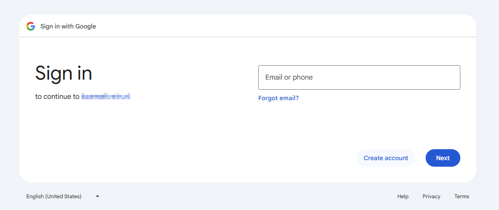

:::note

We highly recommend to setup [authelia](/charts/premium/authelia/setup-guide)) instead.

:::

This chart makes it possible to have a layer of security in front of your publicly exposed charts.
It supports Google, OIDC, and generic OAuth2.
Please read the [GitHub README of the original project](https://github.com/thomseddon/traefik-forward-auth) for your
authentication options.

:::note

Generally, phone apps do not support redirection during their authentication flow, so this middleware is more suitable for
protecting portals that you would access through a browser.

:::

## A standard setup (auth host mode)

This method will add a middleware to the traefik instance with Google authentication which then you can apply on any charts
with either subdomain or path prefix Ingress rules.
The example domain will be `https://example.com` which should be substituted to your externally accessible domain name.

### Setting up traefik-forward-auth
Follow this steps [here](https://github.com/thomseddon/traefik-forward-auth#google) to setup Google developer console.
Assuming you have set up the `Client ID for Web application` in the Google developer console and set the `Authorized redirect URIs` to
`https://auth.example.com/_oauth`, start deploying traefik-forward-auth.

Most important details to configure:
- Setup ingress to `auth.example.com`
- Set a `secret` (it's mandatory, but can be any string of your choosing).
- Set `authHost` to `auth.example.com`.
- Add your email to `whitelist` as array.
- Add your root domain to `cookieDomain`
- Set the `clientId` and `clientSecret` to the ones presented on the developer console.
- `prompt` needs to be set empty.
- As it is a stateless program, it doesn't need any special permissions or storage.

```yaml
// values.yaml
ingress:
  main:
    enabled: true
    hosts:
      - host: auth.${DOMAIN}
    integrations:
      traefik:
        enabled: true
      certManager:
        enabled: true
        certificateIssuer: cloudflare

tfaAppOptions:
  secret: something-random

tfaAuthOptions:
  authHost: auth.${DOMAIN}
  urlPath: /_oauth
  defaultAction: auth
  defaultProvider: google
  whitelist:
    - ${EMAIL1}
    - ${EMAIL2}
    - ${EMAIL3}

tfaCookieOptions:
  cookieDomain:
    - ${DOMAIN}

tfaGoogleOptions:
  clientId: ${GOOGLE_CLIENTID}
  clientSecret: ${GOOGLE_SECRET}
  prompt: ""
```
<br>

### Creating the middleware on traefik

The traefik instance has to be made aware of the forward authentication. Edit in traefik configuration:

- Add to `websecure` entrypoint and enable `Accept forwarded headers`.
- Add your default gateway (internal router IP) to `Trusted IPs` if using hairpin NAT. If you are using DNS override for your
  domain name, you can probably skip this part.

```yaml
service:
  tcp:
    loadBalancerIP: ${IP_TRAEFIK}
    ports:
      websecure:
        forwardedHeaders:
          enabled: true
          trustedIPs:
            - 192.168.1.1
```

- Add the correct middleware

```yaml
middlewares:
  forwardAuth:
    - name: auth
      address: http://traefik-forward-auth.traefik-forward-auth:4181/_oauth
      authResponseHeaders:
        - X-Forwarded-User
      trustForwardHeader: true
```

### Applying the middleware on charts

To actually use the forward authentication, you have to add it to either a chain or by itself to existing charts Ingresses.

```yaml
ingress:
  main:
    enabled: true
    hosts:
      - host: chart.${DOMAIN}
    integrations:
      traefik:
        enabled: true
        middlewares:
          - name: auth
            namespace: traefik
```

### Per-chart whitelist

In case you need per-chart whitelists, you have two options: set up multiple instances of traefik-forward-auth (cumbersome) or
use custom rules. Consult the readme of the original project how to set them.

### Testing

Opening your URL should result in being redirected to Google authentication. Subsequent checks if the auth is working can be
made by opening an incognito window.


